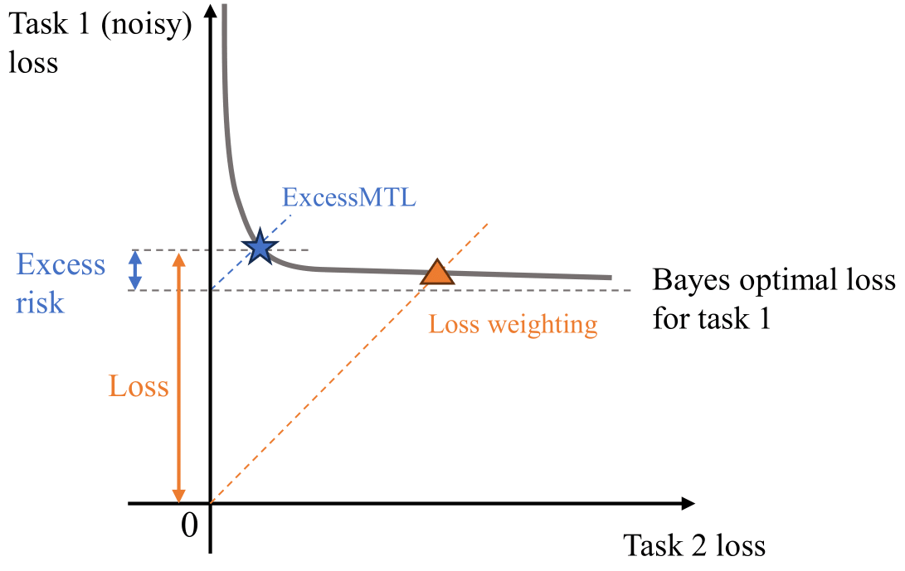

# ExcessMTL

This is the official repo for the algorithm ExcessMTL in the paper ["Robust Multi-Task Learning with Excess Risks"](https://arxiv.org/abs/2402.02009) at ICML 2024. The codebase is based on the github repo [LibMTL](https://github.com/median-research-group/LibMTL). ExcessMTL is implemented in ```LibMTL/weighting/ExcessMTL.py```.

[<center></center>](excessmtl.png)

# Abstract
Multi-task learning (MTL) considers learning a joint model for multiple tasks by optimizing a convex combination of all task losses. To solve the optimization problem, existing methods use an adaptive weight updating scheme, where task weights are dynamically adjusted based on their respective losses to prioritize difficult tasks. However, these algorithms face a great challenge whenever label noise is present, in which case excessive weights tend to be assigned to noisy tasks that have relatively large Bayes optimal errors, thereby overshadowing other tasks and causing performance to drop across the board. To overcome this limitation, we propose Multi-Task Learning with Excess Risks (ExcessMTL), an excess risk-based task balancing method that updates the task weights by their distances to convergence instead. Intuitively, ExcessMTL assigns higher weights to worse-trained tasks that are further from convergence. To estimate the excess risks, we develop an efficient and accurate method with Taylor approximation. Theoretically, we show that our proposed algorithm achieves convergence guarantees and Pareto stationarity. Empirically, we evaluate our algorithm on various MTL benchmarks and demonstrate its superior performance over existing methods in the presence of label noise.


# Code Usage
Take the Office-Home dataset as an example. First, enter the folder for the Office-Home dataset.
```
cd LibMTL/examples/office
```

Then, specify the configuration for ExcessMTL.
```
python3 main.py --dataset office-home --seed 1 --multi_input --weighting ExcessMTL --dataset_path /your/path/to/dataset --robust_step_size 1 --lr 1e-3 --flip 0.6 --flipped_task Product
```

There are several parameters you can specify:
* `dataset`: Choose either office-home or office-31 in this case.
* `multi_input`: Pass this argument if different tasks have different input data. Only NYUv2 uses the same input data for different tasks.
* `weighting`: Use our algorithm ExcessMTL, or specify any other algorithms implemented by LibMTL.
* `dataset_path`: Specify the path you store the OfficeHome dataset.
* `robust_step_size`: A parameter specific to ExcessMTL and GroupDRO. A larger value makes the task weights change faster with changes in excess risks or losses.
* `flip`: A value between 0 and 1, indicating the amount of noise injected in the training set. 
* `flipped_task`: The task to inject noise.

Note that both `flip` and `flipped_task` are specific to our experimental setup where noise is injected into a task. If you do not pass those arguments, no noise will be injected. Among the four datasets implemented in LibMTL, noise injection is supported in Office-Home and NYUv2.


# Citation
```
@inproceedings{he2024robust,
    title={Robust Multi-Task Learning with Excess Risks},
    author={Yifei He and Shiji Zhou and Guojun Zhang and Hyokun Yun and Yi Xu and Belinda Zeng and Trishul Chilimbi and Han Zhao},
    booktitle={Proceedings of the 41st International Conference on Machine Learning},
    year={2024},
    url={https://proceedings.mlr.press/v235/he24n.html}
}
```
